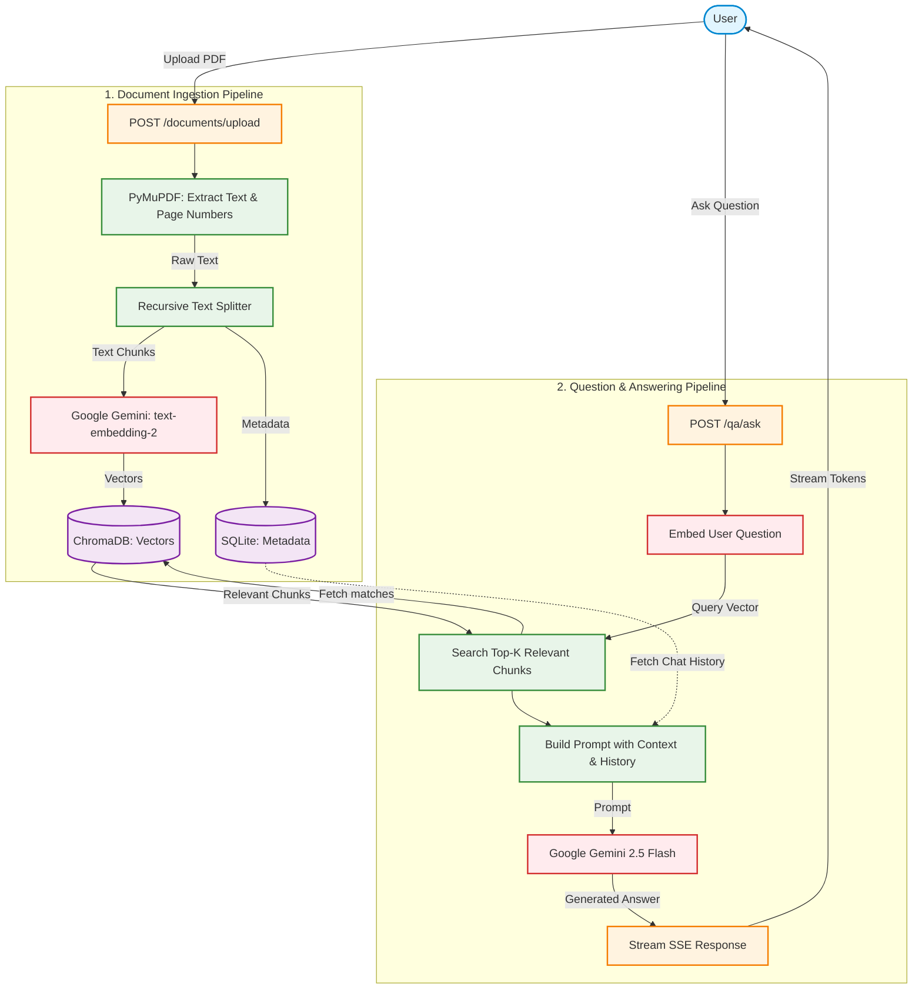

# IR Infotech RAG Assistant — Architecture Diagram

This diagram outlines the complete flow of the Retrieval-Augmented Generation (RAG) system, from document ingestion to question answering.

```mermaid
graph TD
    %% Define Styles
    classDef user fill:#e1f5fe,stroke:#0288d1,stroke-width:2px;
    classDef api fill:#fff3e0,stroke:#f57c00,stroke-width:2px;
    classDef processing fill:#e8f5e9,stroke:#388e3c,stroke-width:2px;
    classDef storage fill:#f3e5f5,stroke:#7b1fa2,stroke-width:2px;
    classDef llm fill:#ffebee,stroke:#d32f2f,stroke-width:2px;

    %% Actors
    User([User]):::user

    %% Ingestion Flow
    subgraph Ingestion Pipeline [1. Document Ingestion Pipeline]
        UploadAPI[POST /documents/upload]:::api
        PDFExtract[PyMuPDF: Extract Text & Page Numbers]:::processing
        Chunker[Recursive Text Splitter]:::processing
        Embedder[Google Gemini: text-embedding-2]:::llm
        VectorDB[(ChromaDB: Vectors)]:::storage
        SQLDB[(SQLite: Metadata)]:::storage
    end

    %% Retrieval & QA Flow
    subgraph QA Pipeline [2. Question & Answering Pipeline]
        AskAPI[POST /qa/ask]:::api
        QueryEmbed[Embed User Question]:::llm
        SearchStore[Search Top-K Relevant Chunks]:::processing
        PromptBuilder[Build Prompt with Context & History]:::processing
        GeminiLLM[Google Gemini 2.5 Flash]:::llm
        SSEStream[Stream SSE Response]:::api
    end

    %% Connections - Ingestion
    User -- "Upload PDF" --> UploadAPI
    UploadAPI --> PDFExtract
    PDFExtract -- "Raw Text" --> Chunker
    Chunker -- "Text Chunks" --> Embedder
    Embedder -- "Vectors" --> VectorDB
    Chunker -- "Metadata" --> SQLDB

    %% Connections - QA
    User -- "Ask Question" --> AskAPI
    AskAPI --> QueryEmbed
    QueryEmbed -- "Query Vector" --> SearchStore
    SearchStore -- "Fetch matches" --> VectorDB
    VectorDB -- "Relevant Chunks" --> SearchStore
    SearchStore --> PromptBuilder
    SQLDB -. "Fetch Chat History" .-> PromptBuilder
    PromptBuilder -- "Prompt" --> GeminiLLM
    GeminiLLM -- "Generated Answer" --> SSEStream
    SSEStream -- "Stream Tokens" --> User
```
