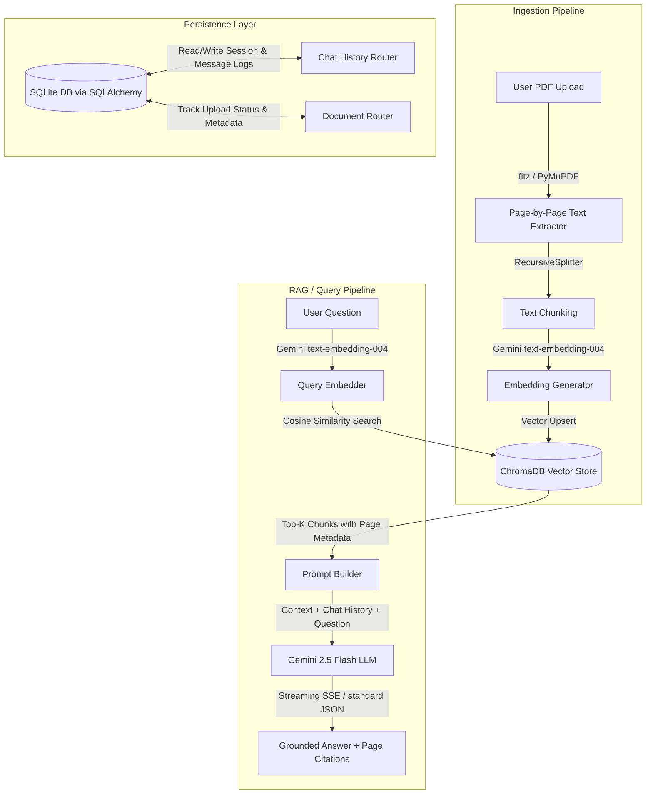

# Round 2 — RAG Document Assistant

An AI-powered document assistant that extracts text from uploaded PDF documents, splits it into semantic chunks, generates vector embeddings, stores them in a local ChromaDB instance, and performs Retrieval-Augmented Generation (RAG) using Google's Gemini API to answer user queries with page-level citations.

---

## System Architecture



---

## Core Features

- **Document Management**: Upload multiple PDFs, list uploaded documents with metadata (size, page count, chunk count), and delete documents (wipes database entries, vector store collections, and disk files).
- **Intelligent Chunking**: Recursively splits documents with configurable sizes and overlaps to keep semantic context whole.
- **Dynamic Semantic Search**: ChromaDB stores 768-dimension vectors and filters search space per-document or across all documents.
- **Source Citations**: Every answer returned is grounded directly in document content and cites the source file name and page number.
- **Chat History**: Supports multi-turn dialogue. Context is passed to Gemini dynamically.
- **Response Streaming**: Optional Server-Sent Events (SSE) streaming for real-time typing effect.
- **API Key Security**: Endpoints protected via standard `X-API-Key` headers.

---

## Tech Stack

- **API Framework**: FastAPI (asynchronous endpoints, automatic OpenAPI Swagger documentation)
- **Database**: SQLite + SQLAlchemy (synchronous ORM)
- **Vector Database**: ChromaDB (persistent local engine)
- **PDF Extraction**: PyMuPDF (`fitz`)
- **LLM & Embeddings**: Google Gemini API via `google-genai` SDK
  - Embeddings: `gemini-embedding-2`
  - LLM: `gemini-2.5-flash`

---

## Setup & Running

### 1. Environment Variables

Create a `.env` file in the project root:

```ini
GEMINI_API_KEY=your-gemini-api-key
APP_NAME="IR Infotech RAG Assistant"
APP_VERSION=1.0.0
DEBUG=False
LOG_LEVEL=INFO

# Database & Storage
DATABASE_URL=sqlite:///./rag_assistant.db
UPLOAD_DIR=uploads
CHROMA_DIR=chroma_data

# RAG configuration
CHUNK_SIZE=1000
CHUNK_OVERLAP=200
TOP_K=5

# Model configs
EMBEDDING_MODEL=gemini-embedding-2
LLM_MODEL=gemini-2.5-flash

# Optional Auth (Leave empty to disable)
API_KEY_AUTH=my-secret-api-key
```

### 2. Local Installation

```bash
# Navigate to the R2 directory
cd R2

# Create virtual environment
python -m venv venv
source venv/bin/activate

# Install dependencies
pip install -r requirements.txt

# Start the server
python -m uvicorn app.main:app --port 8000 --reload
```

---

## API Endpoints Reference

All endpoints (except health and root) require the `X-API-Key` header if `API_KEY_AUTH` is set.

| Method | Endpoint | Description |
|--------|----------|-------------|
| `POST` | `/documents/upload` | Upload PDF files and run them through RAG ingestion |
| `GET` | `/documents` | List all processed documents with metadata |
| `GET` | `/documents/{id}` | Get metadata for a specific document |
| `DELETE` | `/documents/{id}` | Permanently delete a document and its embeddings |
| `POST` | `/qa/ask` | Query the document database (supports JSON & SSE streaming) |
| `GET` | `/chat/sessions` | List all chat sessions and message counts |
| `GET` | `/chat/sessions/{id}` | Get conversation history for a session |
| `DELETE` | `/chat/sessions/{id}` | Delete a chat session and its message logs |
| `GET` | `/health` | Verify database and vector store health |

---

## Example Usage (cURL)

### 1. Upload a Document
```bash
curl -X POST http://localhost:8000/documents/upload \
  -H "X-API-Key: my-secret-api-key" \
  -F "files=@annual_report.pdf"
```

### 2. Ask a Question (JSON response)
```bash
curl -X POST http://localhost:8000/qa/ask \
  -H "X-API-Key: my-secret-api-key" \
  -H "Content-Type: application/json" \
  -d '{
    "question": "What is the net profit reported on page 10?",
    "stream": false,
    "top_k": 5
  }'
```

### 3. Ask a Question (SSE Stream response)
```bash
curl -X POST http://localhost:8000/qa/ask \
  -H "X-API-Key: my-secret-api-key" \
  -H "Content-Type: application/json" \
  -d '{
    "question": "Summarize the core values of the company.",
    "stream": true
  }'
```

---

## Running with Docker

Run the entire application in a Docker container using Docker Compose. The build context is set to the parent directory to package the shared `needful` module.

```bash
# From the R2 directory:
docker-compose up --build -d
```

This starts the API on port `8000` and creates persistent Docker volumes for the SQLite database file and ChromaDB vector store.
tion)
